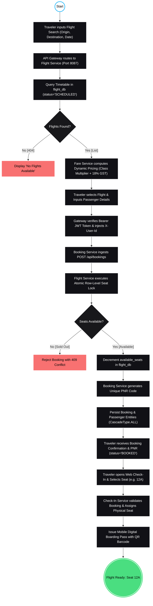

# AeroBook Enterprise Platform - UML Activity Diagram Specification

> **Theme**: Dark Canvas Background (`#000000`), Crisp White Marker Strokes (`#FFFFFF`), Cyan Data Flows (`#38BDF8`), UML 2.5 Standard Notation.

---

## 1. High-Level UML Activity Diagram (Mermaid State & Flow Representation)

---

## 2. Microservices Swimlane Architecture & Partition Matrix

The AeroBook UML Activity Diagram models the complete business operational lifecycle across **6 dedicated architectural partitions**:

| Partition / Swimlane | Port | Technology Stack | Core Business Responsibilities |
| :--- | :---: | :--- | :--- |
| **1. Traveler / Client** | Client UX | React / Mobile Client | Input search criteria, flight selection, passenger data input, PNR storage, web check-in, seat selection |
| **2. API Gateway** | `8083` | Spring Cloud Gateway (Netty) | Unified reverse proxy ingress, JWT signature verification, CORS enforcement, request rate limiting |
| **3. Flight Service** | `8087` | Spring Boot, Spring Data JPA | Flight catalog lookups, schedule timetables, atomic row-level seat locking (`PESSIMISTIC_WRITE`), seat inventory updates |
| **4. Fare Service** | `8089` | Spring Boot, Spring Data JPA | Yield pricing engine, cabin class multipliers (Economy, Business, First), statutory taxes (18% GST), promotional discounts |
| **5. Booking Service** | `8088` | Spring Boot, OpenFeign, Resilience4j | PNR generation, multi-passenger entity composition, booking confirmation, cancellation compensation |
| **6. Check-In Service** | `8090` | Spring Boot, OpenFeign | Airport web check-in, seat matrix locking, unique boarding pass reference generation (`BP-1001-12A`), QR barcode payload |

---

## 3. Detailed Step-by-Step Workflow Walkthrough

### Phase 1: Flight Discovery & Schedule Lookup
1. **Initial Node**: The workflow triggers when an authorized or anonymous customer opens the AeroBook web interface.
2. **Search Criteria**: The traveler submits departure city, arrival destination, date, and cabin class.
3. **Gateway Ingress**: `api-gateway` matches the `/api/flights/**` route and proxies the request to an instance of `flight-service` registered in Eureka.
4. **Timetable Query**: `flight-service` queries `flight_db` for matching flights where `status = 'SCHEDULED'`.
5. **Decision 1 (Found?)**:
   - *If No*: Returns HTTP 404 with message *"No scheduled flights found for the specified route"*.
   - *If Yes*: Forwards flight list to `fare-service` to calculate real-time ticket pricing.

### Phase 2: Yield Pricing & Cabin Multipliers
6. **Fare Calculation**: `fare-service` queries `fare_db` for each flight's pricing rules. It applies class multipliers (e.g. Economy `1.0x`, Business `2.5x`, First `4.0x`), calculates statutory 18% GST, and deducts promotional discounts.
7. **Aggregated Catalog**: Results are streamed back to the client interface displaying comprehensive schedule and cost details.

### Phase 3: Reservation Request & Security Validation
8. **Flight Selection**: Traveler selects their preferred flight and inputs passenger demographic details (legal name, age, gender).
9. **Authentication Check**: `api-gateway` inspects the `Authorization: Bearer <jwt>` header, verifies the cryptographic signature, and injects user identity headers (`X-User-Id`, `X-User-Role`).
10. **Booking Ingestion**: `booking-service` receives `POST /api/bookings` and validates the passenger count and payload structure.

### Phase 4: Atomic Seat Concurrency Control
11. **Seat Availability Verification**: `booking-service` invokes `flight-service` via OpenFeign: `PUT /api/flights/{flightId}/reserve-seats?count=N`.
12. **Decision 2 (Seats Available?)**:
    - *If No (Sold Out)*: `flight-service` rejects the request with **HTTP 409 Conflict**. The workflow halts with a *"Flight Sold Out"* alert.
    - *If Yes*: `flight-service` executes an atomic seat decrement (`UPDATE flights SET available_seats = available_seats - ? WHERE id = ?`) under database row-level locking.

### Phase 5: PNR Generation & Cascade Persistence (Fork/Join)
13. **UML Fork Synchronization**:
    - **Branch A**: Computes a unique alphanumeric Passenger Name Record code (`PNR-XXXXXX`) via `PnrGenerator`.
    - **Branch B**: Computes the final aggregate ticket fare sum.
14. **Database Commit**: Persists the `Booking` entity and cascades insertion to child `Passenger` records in `booking_db` via JPA `CascadeType.ALL`.
15. **UML Join Synchronization**: Waits for database write completion and returns HTTP 201 Created with full booking confirmation to the traveler.

### Phase 6: Airport Web Check-In & Boarding Pass Issuance
16. **Initiate Check-In**: Within 24 hours of flight departure, traveler submits `POST /api/check-ins` with their `bookingId` and desired cabin seat (e.g. `12A`).
17. **Reservation Verification**: `check-in-service` calls `booking-service` via OpenFeign to verify that the booking exists and is in status `BOOKED`.
18. **Seat Allocation & Pass Generation**: `check-in-service` verifies seat `12A` is unassigned, locks the seat, generates a unique barcode reference (`BP-1001-12A`), and persists the `check_in` record.
19. **Activity Final Node**: The digital mobile QR boarding pass is delivered to the customer's device, successfully completing the workflow.

---

## 4. Exception Handling & Concurrency Protocols

1. **Race Condition Prevention during Flash Sales**:
   - Multiple passengers attempting to book the final available seat simultaneously are serialized by MySQL InnoDB row-level locks on the target flight row in `flight_db`. Only the first transaction acquires the lock; subsequent requests receive HTTP 409 Conflict.
2. **Compensating Action on Booking Failure / Cancellation**:
   - If an unhandled exception occurs after seat reservation but before booking persistence, a compensating call is dispatched to `flight-service` to increment `available_seats` back up, ensuring zero lost inventory.
3. **Double Check-In Protection**:
   - A database-level unique constraint on `check_in.boarding_pass_number` and an application-level seat matrix lookup prevent duplicate boarding pass generation for the same passenger or seat.
