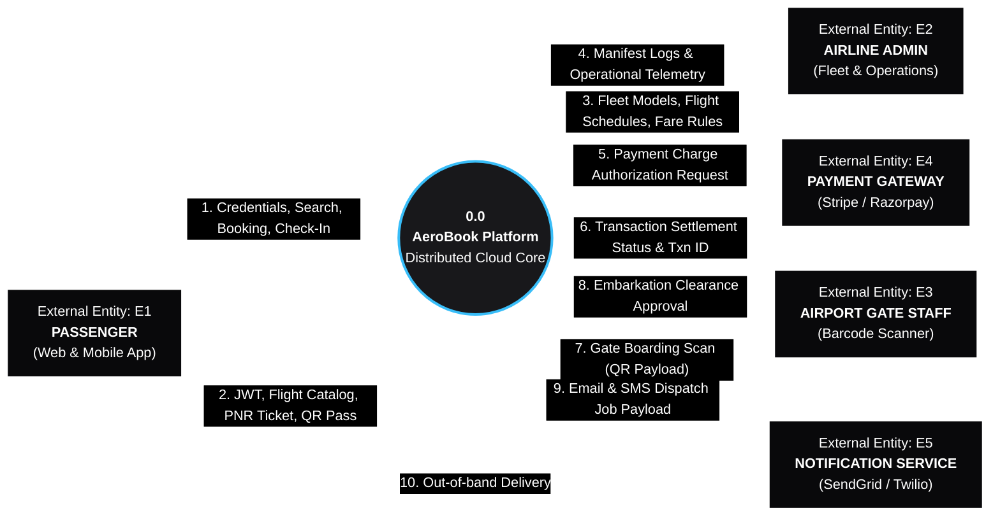
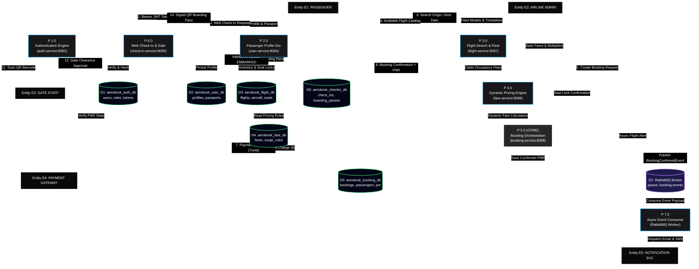

# AeroBook Enterprise Platform — Data Flow Diagram (DFD) Specification

> **Theme**: Dark Canvas Background (`#000000`), Crisp White Marker Strokes (`#FFFFFF`), Enterprise Data Flow & Storage Architecture.

---

## 1. DFD Level 0: System Context Diagram

The Level 0 Context Diagram establishes the boundary of the **AeroBook Reservation Platform**, identifying external source and sink entities and the macro-level data exchanges entering and exiting the platform boundary.

---

## 2. DFD Level 1: Subsystem Decomposition Diagram

The Level 1 DFD decomposes the system into **7 Core Processes (P1.0 to P7.0)**, **7 Isolated Repositories (D1 to D7)**, and shows the explicit data pipelines connecting them.

---

## 3. Comprehensive Data Dictionary

### 3.1 External Entities (Sources & Sinks)

| Entity ID | Name                     | Role              | Primary Data Generated (Source)                                                                               | Primary Data Received (Sink)                                                                             |
| :-------- | :----------------------- | :---------------- | :------------------------------------------------------------------------------------------------------------ | :------------------------------------------------------------------------------------------------------- |
| **E1**    | **Passenger**            | Traveler          | Credentials, Profile updates, Flight queries, Passenger manifests, Payment authorizations, Check-in requests. | JWT Bearer tokens, Flight catalogs, Booking receipts (PNR), Electronic boarding passes (QR), SMS alerts. |
| **E2**    | **Airline Admin**        | Operations Staff  | Aircraft configurations, Seat matrices, Route timetables, Base pricing rules, Surge thresholds.               | Operational logs, Passenger manifests, Flight revenue telemetry.                                         |
| **E3**    | **Airport Gate Staff**   | Ground Operations | 2D QR Barcode scan event at airport boarding gate.                                                            | Visual clearance signal (Green/Red), Audio confirmation, Embarkation status.                             |
| **E4**    | **Payment Gateway**      | Financial Service | Payment settlement status (`SUCCESS`/`FAILED`), Transaction IDs (`txn_id`), Risk fraud score.                 | Charge authorization payload (`amount`, `currency`, `payment_method_token`, `pnr`).                      |
| **E5**    | **Notification Service** | Delivery Channel  | Message dispatch status callbacks (Delivered, Bounced, Queued).                                               | Templated HTML ticket summaries, SMS PNR booking confirmation strings, gate change notices.              |

---

### 3.2 Processes (Transformation Logic)

| Process ID | Name                                | Microservice              | Input Data Flows                                                             | Output Data Flows                                                            | Underlying Transformation Logic                                                                                                                                                      |
| :--------- | :---------------------------------- | :------------------------ | :--------------------------------------------------------------------------- | :--------------------------------------------------------------------------- | :----------------------------------------------------------------------------------------------------------------------------------------------------------------------------------- |
| **P 1.0**  | **Authentication & Access Control** | `auth-service` (8082)     | Credentials (`username`, `password`), Registration payloads, Refresh tokens. | Signed JWT tokens, Expiration timestamps, Account validation claims.         | Evaluates passwords using Spring Security BCryptPasswordEncoder (strength 10). Issues signed HMAC-SHA256 tokens carrying claims and authority sets (`ROLE_PASSENGER`, `ROLE_ADMIN`). |
| **P 2.0**  | **Passenger Profile Store**         | `user-service` (8084)     | User profile updates, Passport identifiers, Travel preferences.              | Sanitized customer entity, Emergency contact confirmation.                   | Validates international passport formatting and expiration dates. Enforces user data sovereignty and GDPR profile rectification.                                                     |
| **P 3.0**  | **Flight Search & Scheduling**      | `flight-service` (8087)   | Search filters (`origin`, `dest`, `date`, `cabinClass`), Fleet schedules.    | Available flight list, Cabin seat availability maps, Temporary seat locks.   | Filters flights matching origin/destination IATA codes and dates. Implements atomic seat locks with 10-minute hold expirations to prevent double-booking.                            |
| **P 4.0**  | **Dynamic Fare Engine**             | `fare-service` (8089)     | Flight ID, Cabin class, Booking timestamp, Demand occupancy ratio.           | Itemized fare quote (Base fare, Demand surge, Fuel surcharge, Taxes, Total). | Computes real-time dynamic pricing using algorithm: `FinalPrice = BaseFare * CabinMultiplier * (1 + SurgeRate) + AirportTaxes`.                                                      |
| **P 5.0**  | **Flight Booking & PNR Workflow**   | `booking-service` (8088)  | Passenger manifest, Flight ID, Selected seats, Payment token.                | Unique 6-character PNR, Electronic ticket record, `BookingConfirmedEvent`.   | Core transaction coordinator. Verifies seat holds with P3.0, executes payment charge with E4, persists reservation in D5, and publishes AMQP event to D7.                            |
| **P 6.0**  | **Web Check-In & Gate Clearance**   | `check-in-service` (8090) | Check-in requests (`pnr`, `lastName`), Gate scanner 2D barcode payload.      | Digital Boarding Pass, Encrypted QR code, Gate clearance validation.         | Enforces flight departure window rules (T-24h to T-1h). Validates PNR status against D5. Generates encrypted 2D QR codes containing PNR, seat, and SHA-256 digital signature.        |
| **P 7.0**  | **Async Notification Dispatcher**   | RabbitMQ Consumer         | `BookingConfirmedEvent` & `CheckInCompletedEvent` payloads from AMQP queue.  | Dispatch requests to external SMTP SendGrid API & SMS Twilio API.            | Consumes messages from RabbitMQ `booking.events` queue. Hydrates HTML email itineraries and triggers asynchronous notifications with retry backoff.                                  |

---

### 3.3 Data Stores (Isolated Databases & Queues)

| Store ID | Name                  | Database Tech | Encapsulated Tables / Queues                         | Coupling & Access Constraints                                           |
| :------- | :-------------------- | :------------ | :--------------------------------------------------- | :---------------------------------------------------------------------- |
| **D1**   | `aerobook_auth_db`    | MySQL 8.0     | `users`, `roles`, `user_roles`, `refresh_tokens`     | Strictly private to `auth-service`. Zero direct external queries.       |
| **D2**   | `aerobook_user_db`    | MySQL 8.0     | `user_profiles`, `passports`, `addresses`            | Strictly private to `user-service`. Accessed via authenticated REST.    |
| **D3**   | `aerobook_flight_db`  | MySQL 8.0     | `flights`, `aircraft`, `seats`, `seat_inventories`   | Strictly private to `flight-service`. High-read caching optimized.      |
| **D4**   | `aerobook_fare_db`    | MySQL 8.0     | `fares`, `surge_multipliers`, `class_pricing_rules`  | Strictly private to `fare-service`. Deterministic pricing calculations. |
| **D5**   | `aerobook_booking_db` | MySQL 8.0     | `bookings`, `passengers`, `booking_payments`, `logs` | Strictly private to `booking-service`. Transactional ACID core.         |
| **D6**   | `aerobook_checkin_db` | MySQL 8.0     | `check_ins`, `boarding_passes`, `gate_verifications` | Strictly private to `check-in-service`. Fast gate validation lookups.   |
| **D7**   | `RabbitMQ Broker`     | AMQP 0-9-1    | Exchange: `aerobook.direct`, Queue: `booking.events` | Decoupled durable message queue with Dead-Letter Exchange (DLX).        |

---

## 4. End-to-End Data Flow Execution Cycles

### Cycle 1: Flight Search to Confirmed Booking (Data Flow 1 → 8)

1. **Flow 1 (Credentials)**: Passenger (E1) sends `POST /api/auth/login` to `P1.0`. Credentials validated against `D1`.
2. **Flow 2 (JWT)**: `P1.0` returns signed Bearer JWT token to E1.
3. **Flow 3 (Search Query)**: E1 submits flight search filters (`origin=JFK`, `destination=LHR`, `date=2026-10-15`) to `P3.0`.
4. **Flow 4 (Catalog Quote)**: `P3.0` queries `D3` and coordinates with `P4.0` (`D4`) to return matching flight cards with dynamic prices.
5. **Flow 5 (Booking Creation)**: E1 selects seats and submits booking request containing passenger manifest and payment token to `P5.0`.
6. **Flow 6 & 7 (Payment Settlement)**: `P5.0` holds seats with `P3.0`, then calls `E4` (Payment Gateway). `E4` settles the transaction and returns `txn_id`.
7. **Flow 8 (PNR Commitment)**: `P5.0` commits the booking with status `CONFIRMED` and unique 6-character PNR in `D5`, returns confirmation to E1, and publishes `BookingConfirmedEvent` to `D7`.

### Cycle 2: Web Check-In & Airport Gate Embarkation (Data Flow 9 → 12)

1. **Flow 9 (Check-In Request)**: Passenger (E1) accesses web portal 20 hours prior to departure and submits `PNR` + `LastName` to `P6.0`.
2. **Eligibility Validation**: `P6.0` verifies that departure is between T-24h and T-1h, and verifies PNR payment confirmation with `D5`.
3. **Flow 10 (QR Boarding Pass)**: `P6.0` creates a boarding pass entity in `D6`, encodes flight details into a digital 2D QR matrix with a cryptographically signed HMAC payload, and streams the digital boarding pass to E1.
4. **Flow 11 (Airport Gate Scan)**: Airport Gate Staff (E3) scans passenger's phone screen using an optical laser scanner at the boarding gate.
5. **Flow 12 (Gate Embarkation Clearance)**: `P6.0` decodes the QR token, verifies digital authenticity, verifies passenger has not already embarked, atomically updates boarding status to `EMBARKED` in `D6`, and flashes green clearance to E3.

### Cycle 3: Asynchronous Event Notification Dispatch (RabbitMQ AMQP)

1. **Event Publication**: Upon booking completion, `P5.0` serializes a `BookingConfirmedEvent` containing PNR, flight details, passenger names, and total fare, publishing it to RabbitMQ Exchange `aerobook.direct`.
2. **Queue Persistence**: Message broker (`D7`) buffers the payload in durable queue `booking.events`.
3. **Event Consumption**: Notification Worker (`P7.0`) consumes the event via AMQP protocol.
4. **Out-of-Band Delivery**: `P7.0` formats an HTML electronic ticket and dispatches calls to SendGrid (Email) and Twilio (SMS).
5. **Zero Latency Impact**: Passenger receives instantaneous REST response for booking without waiting for third-party email/SMS round-trips.

---

## 5. Security & Architectural Guarantees

1. **Zero PAN Storage**: Credit card numbers never touch AeroBook disk storage or databases. All transactions use opaque client-side payment tokens authorized directly with external gateways (PCI-DSS Scope Minimization).
2. **Database-Per-Service Isolation**: Strict microservice architectural isolation. Direct SQL cross-joins between databases (e.g., joining `bookings` with `users`) are architecturally barred, preventing catastrophic cascade locking.
3. **At-Least-Once Delivery**: RabbitMQ queues are marked as `durable: true` with persistent delivery mode. Acknowledgments (`basicAck`) are emitted only after notification dispatch succeeds. Failed messages are routed to `booking.dlq` for forensic analysis.
