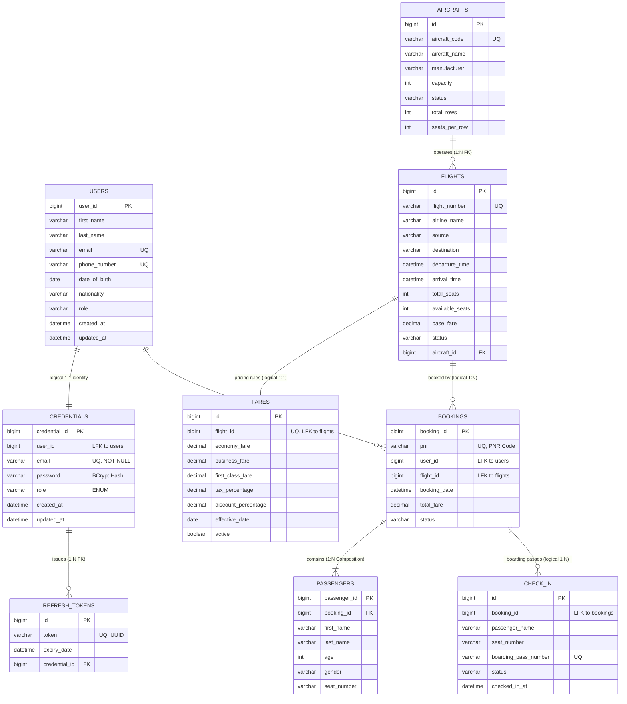

# AeroBook Enterprise Platform - System Entity-Relationship (ER) Specification

> **Theme**: Dark Canvas Background (`#000000`), Crisp White Marker Strokes (`#FFFFFF`), Cyan Logical Links (`#38BDF8`), Crow's Foot Relational Notation.

---

## 1. High-Level Entity-Relationship (ER) Diagram

---

## 2. Microservices Database-per-Service Architecture

AeroBook strictly enforces the **Database-per-Service** architectural pattern. Rather than sharing a single monolithic relational database with cross-table foreign key constraints and distributed locks, each microservice owns and encapsulates its dedicated MySQL schema:

| Microservice | Port | Schema Name | Tables Owned | Primary Business Responsibility |
| :--- | :---: | :--- | :--- | :--- |
| **`auth-service`** | `8082` | `aerobook_auth_db` | `credentials`, `refresh_tokens` | Identity credentials, BCrypt hashes, JWT tokens, session lifecycle |
| **`user-service`** | `8084` | `aerobook_user_db` | `users` | Customer demographics, personal data, contact coordinates |
| **`flight-service`** | `8087` | `flight_db` | `aircrafts`, `flights` | Commercial fleet aircraft catalog, flight schedules, live seat counts |
| **`fare-service`** | `8089` | `fare_db` | `fares` | Yield management, tiered cabin pricing, statutory taxes, coupons |
| **`booking-service`** | `8088` | `booking_db` | `bookings`, `passengers` | PNR generation, passenger composition, reservation states |
| **`check-in-service`** | `8090` | `checkin_db` | `check_in` | Airport digital check-in, seat allocations, QR boarding passes |

---

## 3. Detailed Data Dictionary & Schema Specifications

### 3.1 `aerobook_auth_db`
#### Table: `credentials`
- **`credential_id`** `BIGINT AUTO_INCREMENT` [PK] — Unique identifier for account authentication.
- **`user_id`** `BIGINT NOT NULL` [LFK] — Logical reference linking to `users.user_id` in `user-service`.
- **`email`** `VARCHAR(100) NOT NULL UNIQUE` [UQ] — Unique login handle.
- **`password`** `VARCHAR(255) NOT NULL` — 60-character irreversible BCrypt cryptographic password hash.
- **`role`** `VARCHAR(50) NOT NULL` — Security authority enum: `ROLE_USER`, `ROLE_ADMIN`.
- **`created_at`** / **`updated_at`** `DATETIME NOT NULL` — Audit timestamps.

#### Table: `refresh_tokens`
- **`id`** `BIGINT AUTO_INCREMENT` [PK] — Refresh token record identifier.
- **`token`** `VARCHAR(255) NOT NULL UNIQUE` [UQ] — High-entropy UUID v4 token string.
- **`expiry_date`** `DATETIME NOT NULL` — Timestamp when token expires.
- **`credential_id`** `BIGINT NOT NULL` [FK] — Physical foreign key pointing to `credentials.credential_id` (`ON DELETE CASCADE`).

---

### 3.2 `aerobook_user_db`
#### Table: `users`
- **`user_id`** `BIGINT AUTO_INCREMENT` [PK] — Unique customer account identifier.
- **`first_name`** / **`last_name`** `VARCHAR(50) NOT NULL` — Legal travel identity names.
- **`email`** `VARCHAR(100) NOT NULL UNIQUE` [UQ] — Contact electronic mail address.
- **`phone_number`** `VARCHAR(15) NOT NULL UNIQUE` [UQ] — Mobile phone number for SMS alerts.
- **`date_of_birth`** `DATE NULL` — Passenger birth date for age validation.
- **`nationality`** `VARCHAR(50) NULL` — Citizenship country for international travel validation.
- **`role`** `VARCHAR(50) NOT NULL DEFAULT 'ROLE_USER'` — Platform security authority.
- **`created_at`** / **`updated_at`** `DATETIME NOT NULL` — Audit timestamps.

---

### 3.3 `flight_db`
#### Table: `aircrafts`
- **`id`** `BIGINT AUTO_INCREMENT` [PK] — Aircraft inventory database ID.
- **`aircraft_code`** `VARCHAR(50) NOT NULL UNIQUE` [UQ] — Aircraft tail registration number (e.g., `A320-001`).
- **`aircraft_name`** `VARCHAR(100) NOT NULL` — Commercial model name (e.g., `Airbus A320neo`).
- **`manufacturer`** `VARCHAR(100) NOT NULL` — Aircraft manufacturer (Airbus, Boeing).
- **`capacity`** `INT NOT NULL` — Maximum passenger seating capacity.
- **`status`** `VARCHAR(20) NOT NULL` — Aircraft status: `ACTIVE`, `MAINTENANCE`, `RETIRED`.
- **`total_rows`** / **`seats_per_row`** `INT NULL` — Cabin seat layout geometry.

#### Table: `flights`
- **`id`** `BIGINT AUTO_INCREMENT` [PK] — Flight schedule identifier.
- **`flight_number`** `VARCHAR(50) NOT NULL UNIQUE` [UQ] — Flight operational code (e.g., `AI101`).
- **`airline_name`** `VARCHAR(100) NOT NULL` — Operating airline carrier (e.g., Air India).
- **`source`** / **`destination`** `VARCHAR(50) NOT NULL` — Origin and destination IATA airport codes.
- **`departure_time`** / **`arrival_time`** `DATETIME NOT NULL` — Scheduled departure and arrival instants.
- **`total_seats`** `INT NOT NULL` — Total seat capacity mirrored from aircraft.
- **`available_seats`** `INT NOT NULL` — Real-time remaining seats available for sale.
- **`base_fare`** `DECIMAL(12,2) NOT NULL` — Baseline passenger ticket fare before class multipliers.
- **`status`** `VARCHAR(20) NOT NULL` — `SCHEDULED`, `DELAYED`, `CANCELLED`, `COMPLETED`.
- **`aircraft_id`** `BIGINT NOT NULL` [FK] — Physical foreign key pointing to `aircrafts.id`.

---

### 3.4 `fare_db`
#### Table: `fares`
- **`id`** `BIGINT AUTO_INCREMENT` [PK] — Pricing record identifier.
- **`flight_id`** `BIGINT NOT NULL UNIQUE` [LFK, UQ] — Logical reference linking to `flights.id` in `flight-service`.
- **`economy_fare`** `DECIMAL(10,2) NOT NULL` — Base ticket price for Economy Class seating.
- **`business_fare`** `DECIMAL(10,2) NULL` — Premium ticket price for Business Class seating.
- **`first_class_fare`** `DECIMAL(10,2) NULL` — Luxury ticket price for First Class seating.
- **`tax_percentage`** `DECIMAL(5,2) DEFAULT 18.00` — Statutory government tax rate (18% GST).
- **`discount_percentage`** `DECIMAL(5,2) DEFAULT 0.00` — Promotional discount rate.
- **`effective_date`** `DATE NULL` — Tariff activation date.
- **`active`** `BOOLEAN NOT NULL DEFAULT TRUE` — Indicates active pricing status.

---

### 3.5 `booking_db`
#### Table: `bookings`
- **`booking_id`** `BIGINT AUTO_INCREMENT` [PK] — Unique reservation identifier.
- **`pnr`** `VARCHAR(20) NOT NULL UNIQUE` [UQ] — High-entropy 6-to-12 character Passenger Name Record string.
- **`user_id`** `BIGINT NOT NULL` [LFK] — Logical reference linking to `users.user_id` in `user-service`.
- **`flight_id`** `BIGINT NOT NULL` [LFK] — Logical reference linking to `flights.id` in `flight-service`.
- **`booking_date`** `DATETIME NOT NULL` — Reservation confirmation instant.
- **`total_fare`** `DECIMAL(12,2) NOT NULL` — Grand total calculated fare (`(baseFare * classMultiplier) + taxes - discount`).
- **`status`** `VARCHAR(20) NOT NULL` — Lifecycle status: `BOOKED`, `CANCELLED`.

#### Table: `passengers`
- **`passenger_id`** `BIGINT AUTO_INCREMENT` [PK] — Individual traveler database identifier.
- **`booking_id`** `BIGINT NOT NULL` [FK] — Physical foreign key pointing to `bookings.booking_id` (`ON DELETE CASCADE`).
- **`first_name`** / **`last_name`** `VARCHAR(50) NOT NULL` — Traveler full legal names.
- **`age`** `INT NOT NULL` — Traveler age in completed years.
- **`gender`** `VARCHAR(10) NOT NULL` — Male, Female, Other.
- **`seat_number`** `VARCHAR(10) NULL` — Assigned cabin seat coordinate (e.g., `12A`).

---

### 3.6 `checkin_db`
#### Table: `check_in`
- **`id`** `BIGINT AUTO_INCREMENT` [PK] — Unique check-in record primary key.
- **`booking_id`** `BIGINT NOT NULL` [LFK] — Logical reference linking to `bookings.booking_id`.
- **`passenger_name`** `VARCHAR(100) NOT NULL` — Passenger legal name confirmed during boarding.
- **`seat_number`** `VARCHAR(10) NOT NULL` — Allocated physical cabin seat.
- **`boarding_pass_number`** `VARCHAR(50) NOT NULL UNIQUE` [UQ] — Issued barcode identifier (e.g. `BP-1001-12A`).
- **`status`** `VARCHAR(30) NOT NULL DEFAULT 'CHECKED_IN'` — Boarding status.
- **`checked_in_at`** `DATETIME NOT NULL` — Airport gate check-in timestamp.

---

## 4. Normalization Analysis (3NF Verification)

Every table across all 6 AeroBook microservices satisfies the **Third Normal Form (3NF)**:
1. **First Normal Form (1NF)**:
   - All column values are atomic (e.g. single email, single seat number, single timestamp).
   - No repeating groups or serialized multi-value delimited strings.
   - Primary keys uniquely identify every row.
2. **Second Normal Form (2NF)**:
   - All tables are in 1NF.
   - All non-key attributes are fully functionally dependent on the entire primary key (no partial functional dependencies, as all tables employ single-column surrogate primary keys `BIGINT AUTO_INCREMENT`).
3. **Third Normal Form (3NF)**:
   - All tables are in 2NF.
   - Zero transitive dependencies: no non-key attribute is functionally dependent on another non-key attribute. For instance, customer contact details are stored in `users`, NOT duplicated inside `bookings` or `credentials`. Flight schedule details are stored in `flights`, NOT duplicated inside `fares` or `bookings`.

---

## 5. Cross-Microservice Referential Integrity Strategies

Because foreign keys cannot cross separate database schemas in a microservices environment, AeroBook maintains referential integrity through three architectural mechanisms:

1. **Client-Side Contract Enforcement (OpenFeign + Resilience4j)**:
   - When `booking-service` creates a reservation, it invokes `flight-service` via OpenFeign to verify that `flightId` exists and that `availableSeats >= passengerCount`.
   - Seat inventory decrement is executed synchronously within `flight-service` under row-level database locking.
2. **Compensating Actions (Saga Orchestration)**:
   - If a booking reservation is cancelled via `PUT /api/bookings/{id}/cancel`, `booking-service` marks the booking as `CANCELLED` and issues an asynchronous compensating call to `flight-service` to release the reserved seats back into `availableSeats`.
3. **Idempotent Web Check-In**:
   - `check-in-service` ensures each passenger boarding pass is assigned once using a database-level unique constraint on `boarding_pass_number` and validating the passenger reservation status via OpenFeign before issuance.
