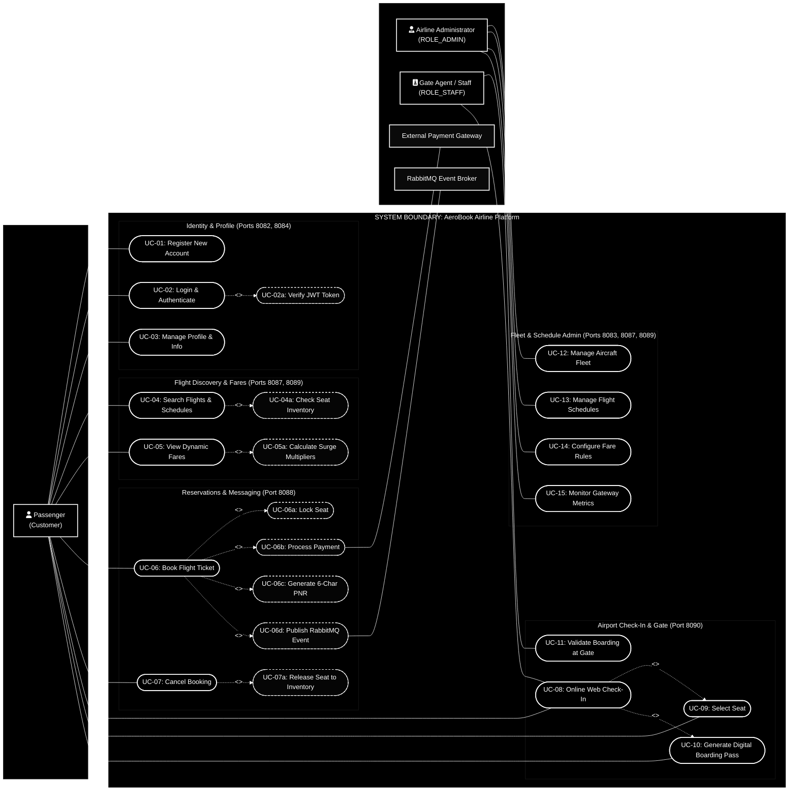

# AeroBook Enterprise Platform - System Use Case Diagram & Specification

> **Theme**: Black Canvas Background (`#000000`), Crisp White Marker Strokes (`#FFFFFF`), UML 2.5 Standard Notation.

---

## 1. High-Level UML Use Case Diagram (Black & White Theme)

---

## 2. Actors Specification

| #   | Actor                         | Type             | Description & Responsibilities                                                                                                                 | Security Role                |
| --- | ----------------------------- | ---------------- | ---------------------------------------------------------------------------------------------------------------------------------------------- | ---------------------------- |
| 1   | **Passenger (Traveler)**      | Primary Human    | Books flights, views dynamic fares, manages reservations, performs online check-in, downloads digital QR boarding passes.                      | `ROLE_PASSENGER` / Anonymous |
| 2   | **Airline Administrator**     | Primary Human    | Manages aircraft fleet inventory, configures flight routes and departure schedules, configures dynamic pricing rules, inspects gateway health. | `ROLE_ADMIN`                 |
| 3   | **Airport Gate Staff**        | Primary Human    | Inspects passenger credentials at the boarding gate, verifies digital boarding pass QR codes, marks passengers as `BOARDED`.                   | `ROLE_STAFF`                 |
| 4   | **External Payment Gateway**  | Secondary System | Processes credit/debit card transactions during ticket reservation and executes refunds upon cancellation.                                     | External Service API         |
| 5   | **RabbitMQ Messaging Broker** | Secondary System | Asynchronous message broker delivering booking confirmations, payment events, and departure alert notifications.                               | AMQP Broker (Port 5672)      |

---

## 3. Use Case Catalog & Microservice Traceability

| Use Case ID | Use Case Name             | Primary Actor | Description                                                                                | Target Microservice & Endpoint                                 |
| ----------- | ------------------------- | ------------- | ------------------------------------------------------------------------------------------ | -------------------------------------------------------------- |
| **UC-01**   | Register New Account      | Passenger     | Creates a traveler account with hashed BCrypt credentials and role assignment.             | `auth-service` & `user-service` `POST /api/auth/register`  |
| **UC-02**   | Login & Authenticate      | All Actors    | Validates credentials and returns an encrypted JWT Bearer access token.                    | `auth-service` `POST /api/auth/login`                      |
| **UC-03**   | Manage Profile & Info     | Passenger     | Updates passport number, contact phone, residential address, and preferences.              | `user-service` `GET/PUT /api/v1/users/{id}`                |
| **UC-04**   | Search Flights & Routes   | Passenger     | Queries available flights by origin airport, destination airport, and date.                | `flight-service` `GET /api/flights/search`                 |
| **UC-05**   | View Dynamic Fares        | Passenger     | Calculates real-time price quotes based on seat class, demand surge, and dates.            | `fare-service` `POST /api/fares/calculate`                 |
| **UC-06**   | Book Flight Ticket        | Passenger     | Reserves seat, processes payment, generates a 6-character PNR, and publishes notification. | `booking-service` `POST /api/bookings`                     |
| **UC-07**   | Cancel Booking            | Passenger     | Cancels reservation, initiates refund request, and releases locked seat back to inventory. | `booking-service` `DELETE /api/bookings/{id}`              |
| **UC-08**   | Online Web Check-In       | Passenger     | Performs web check-in within 24h of flight departure using PNR and passenger name.         | `check-in-service` `POST /api/check-ins`                   |
| **UC-09**   | Select Seat               | Passenger     | Chooses preferred seat (Window, Aisle, Middle, Extra Legroom) from seat matrix.            | `check-in-service` `POST /api/check-ins/select-seat`       |
| **UC-10**   | Generate Boarding Pass    | Passenger     | Generates digital boarding pass containing security verification QR code string.           | `check-in-service` `GET /api/check-ins/{id}/boarding-pass` |
| **UC-11**   | Validate Boarding at Gate | Gate Staff    | Scans QR code or enters check-in ID at boarding gate to mark passenger as BOARDED.         | `check-in-service` `PUT /api/check-ins/{id}/board`         |
| **UC-12**   | Manage Aircraft Fleet     | Admin         | Registers new aircraft (Boeing, Airbus), configures seat capacities and models.            | `flight-service` `POST/GET /api/admin/aircrafts`           |
| **UC-13**   | Manage Flight Schedules   | Admin         | Creates new flight routes, assigns aircraft, departure/arrival times, and status.          | `flight-service` `POST/GET /api/admin/flights`             |
| **UC-14**   | Configure Fare Rules      | Admin         | Establishes base pricing, surge coefficients, baggage fees, and cabin multipliers.         | `fare-service` `POST/PUT /api/fares`                       |
| **UC-15**   | Monitor Gateway Metrics   | Admin         | Inspects real-time routing health, microservice status directory, and RBAC matrix.         | `api-gateway` `GET /api/gateway/health`                    |

---

## 4. Detailed Use Case Specifications (Core Flows)

### UC-06: Book Flight Ticket (`<<include>>` Cascade)

- **Primary Actor**: Passenger
- **Preconditions**:
  1. Passenger is authenticated with valid JWT token.
  2. Selected flight has available seats in the chosen cabin class.
- **Main Success Scenario**:
  1. Passenger submits flight number, travel date, passenger information, and chosen seat class.
  2. System locks requested seat in `flight-service` (`<<include>> UC-06a`).
  3. System calculates verified fare through `fare-service`.
  4. System processes payment transaction (`<<include>> UC-06b`).
  5. System generates an immutable, collision-free 6-character alphanumeric PNR (e.g. `AB7K9Q`) (`<<include>> UC-06c`).
  6. System creates booking record with status `CONFIRMED`.
  7. System publishes `BookingCreatedEvent` to RabbitMQ queue `booking.events` (`<<include>> UC-06d`).
  8. Passenger receives booking summary and PNR receipt.
- **Extensions / Exceptions**:
  - _2a. Seat unavailable_: Booking fails with `409 Conflict - No seats available`.
  - _4a. Payment declined_: Locked seat is unlocked and booking is aborted.

---

### UC-08: Online Web Check-In & Boarding Pass

- **Primary Actor**: Passenger
- **Preconditions**:
  1. Booking status is `CONFIRMED`.
  2. Departure is within 24 hours.
- **Main Success Scenario**:
  1. Passenger enters PNR and Last Name.
  2. System verifies booking status with `booking-service`.
  3. Passenger selects seat from cabin layout (`<<include>> UC-09`).
  4. System marks check-in status as `CHECKED_IN`.
  5. System creates digital Boarding Pass with unique QR hash string (`<<include>> UC-10`).
  6. Passenger downloads boarding pass.
